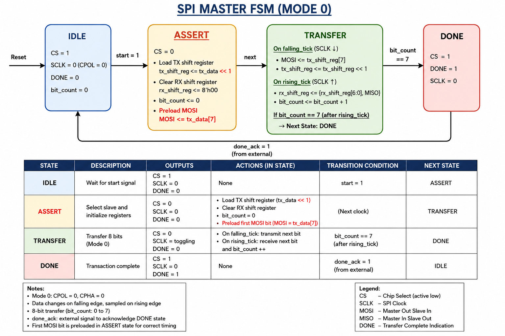

# SPI Master Controller Design in Verilog HDL

## Overview

This project implements an SPI (Serial Peripheral Interface) Master Controller using Verilog HDL. The design supports SPI Mode-0 communication and performs full-duplex 8-bit data transfer between a master and slave device.

The controller is based on a Finite State Machine (FSM) architecture and includes clock generation, chip-select control, transmit and receive data paths, and transaction completion signaling.

---

## Features

- SPI Mode-0 (CPOL = 0, CPHA = 0)
- 100 MHz to 1 MHz Clock Divider
- FSM-Based Control Logic
- 8-bit MSB-First Data Transfer
- MOSI Transmission
- MISO Reception
- Chip Select (CS) Control
- Transaction Completion (DONE) Signal
- Full-Duplex Communication
- Modular RTL Design

---

## Design Specifications

| Parameter | Value |
|------------|---------|
| FPGA Clock Frequency | 100 MHz |
| SPI Clock Frequency | 1 MHz |
| Data Width | 8-bit |
| SPI Mode | Mode-0 |
| CPOL | 0 |
| CPHA | 0 |
| Transmission Order | MSB First |

---

## Architecture

The SPI Master consists of the following blocks:

- Clock Divider
- Finite State Machine (FSM)
- Transmit Shift Register
- Receive Shift Register
- Bit Counter
- SPI Interface Signals

---

## FSM Diagram



---

## FSM States

### IDLE
- Waits for start signal
- Chip Select remains high
- SPI clock disabled

### ASSERT
- Chip Select asserted low
- Loads transmit data into shift register
- Clears receive shift register
- Resets bit counter
- Preloads first MOSI bit for correct SPI Mode-0 timing

### TRANSFER
- Enables SPI clock generation
- Transmits data through MOSI on falling edge
- Receives data through MISO on rising edge
- Increments bit counter after each received bit

### DONE
- Transaction completed
- Chip Select deasserted
- DONE signal asserted
- Returns to IDLE state

---

## SPI Mode-0 Timing

- Clock idle state is LOW
- Data changes on the falling edge of SCLK
- Data is sampled on the rising edge of SCLK
- Communication is full-duplex

---

## Project Structure

```text
spi-master-controller-verilog
│
├── RTL
│   └── spi_master.v
│
├── Testbench
│   └── tb_spi_master.v
│
├── SPI_MODE0_FSM.png
│
└── README.md
```

---

## Tools Used

- Verilog HDL
- Xilinx Vivado
- Vivado Simulator

---

## Key Learnings

- Finite State Machine Design
- SPI Protocol Implementation
- Clock Divider Design
- Shift Register Operations
- Serial Communication Protocols
- RTL Design Methodology
- Functional Simulation and Debugging

---

## Future Enhancements

- SPI Slave Controller
- Support for SPI Modes 1, 2 and 3
- Configurable Data Width
- Multi-Slave Support
- FIFO-Based TX/RX Buffers

---

## Author

**Siba Prasad Mishra**

M.Tech in Microelectronics and VLSI Design  
BITS Pilani, Goa Campus
